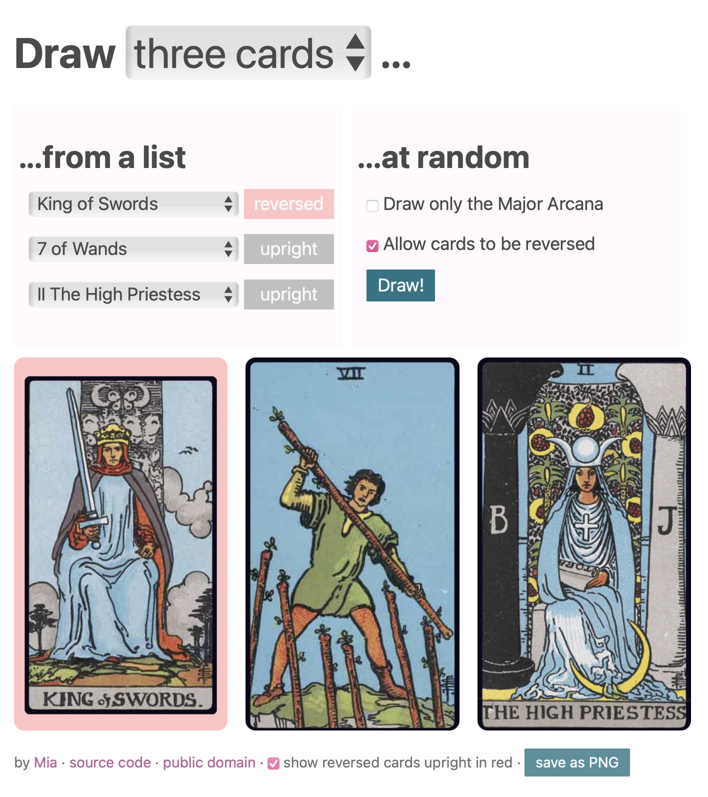

# [tarot](https://yunru.se/tarot)

A small little site for drawing Tarot cards, or quickly sharing those you've drawn.
Cards can be saved quickly as an image; you can share the URL, too.

## Credit

This project is [public domain under CC0](https://creativecommons.org/public-domain/cc0/); do what you want with it!

Scans of [Pamela Colman Smith's famous cards](https://en.wikipedia.org/wiki/Rider–Waite_Tarot), as interpreted by Waite and published by Rider (aka the Rider-Waite-Smith deck) were sourced from [lucielalles](https://luciellaes.itch.io/rider-waite-smith-tarot-cards-cc0).

Interpretations, as stored in `interpretations.json` are NOT public domain as they include excerpts from content that may be copyrighted:
- Key to the Tarot by Arthur Edward Waite
- [Labyrinthos](https://labyrinthos.co/) by Tina Gong
